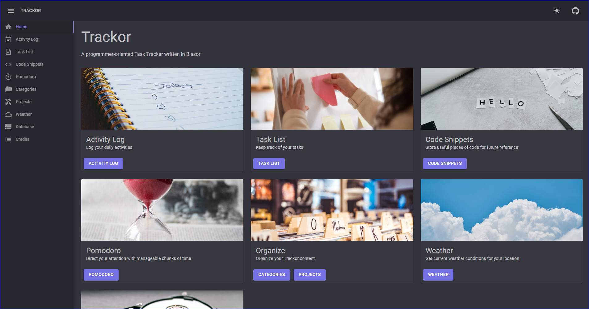
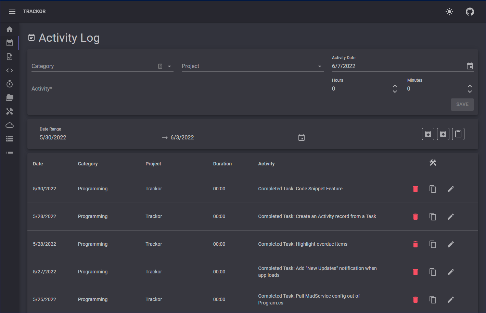
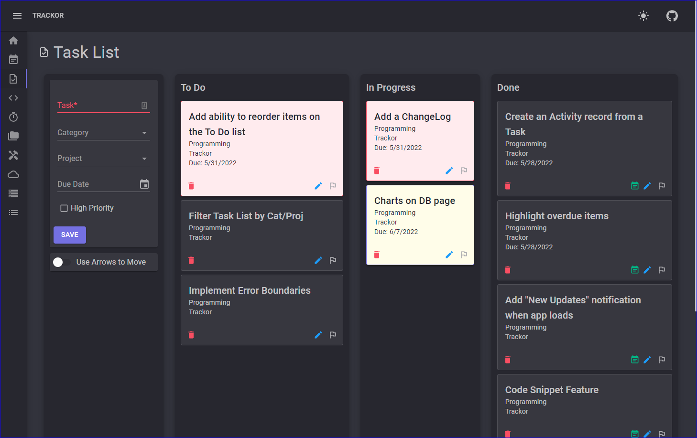
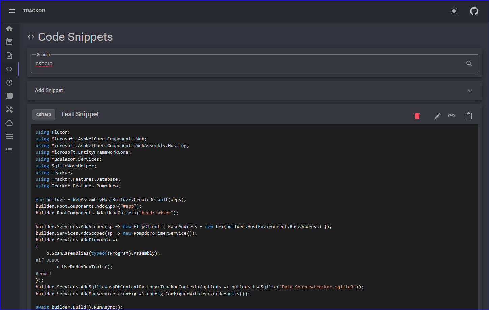

## Trackor

### A developer-oriented task tracker written in Blazor WebAssembly

#### What Trackor is:
Trackor is a side-project I'm using to experiment with a few technologies
that interest me:
- [Blazor WebAssembly](https://dotnet.microsoft.com/en-us/apps/aspnet/web-apps/blazor)
- PWA ([Progressive Web Application](https://en.wikipedia.org/wiki/Progressive_web_application))
- [EF Core](https://docs.microsoft.com/en-us/ef/core/) backed by a SQLite
 database, _in the browser cache_, with the help of
 [SqliteWasmHelper](https://github.com/JeremyLikness/SqliteWasmHelper)
- Application state using the Flux pattern with the [Fluxor](https://github.com/mrpmorris/Fluxor) library
- [MudBlazor](https://www.mudblazor.com/) components and UI styling
- [Azure Static Web Apps](https://azure.microsoft.com/en-us/services/app-service/static/)

It is a web application that has no back-end services - everything is accomplished
locally in the browser. The project is deployed to: [https://app.trackor.dev](https://app.trackor.dev)

#### What Trackor is not:
Trackor is not a product. I don't have the time or resources to maintain
a full-blown project with updates and support indefinitely. Feel free to
use the code here as inspiration for your own project if you'd like.

#### Screenshots

##### Landing Page

##### Activity Log

##### Task List

##### Code Snippets

##### Pomodoro Timer

##### Database Download / Restore
